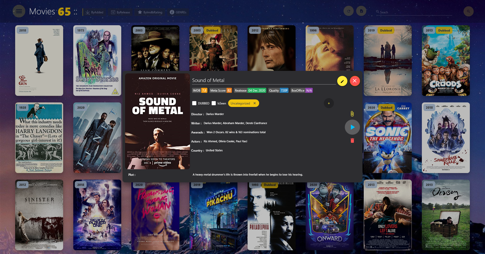
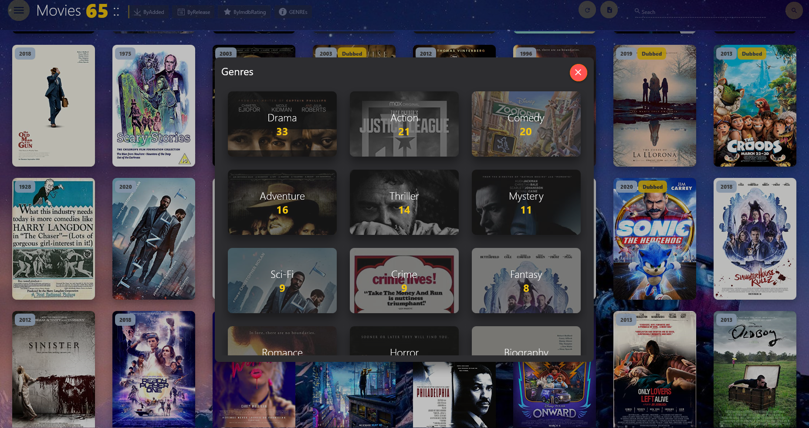
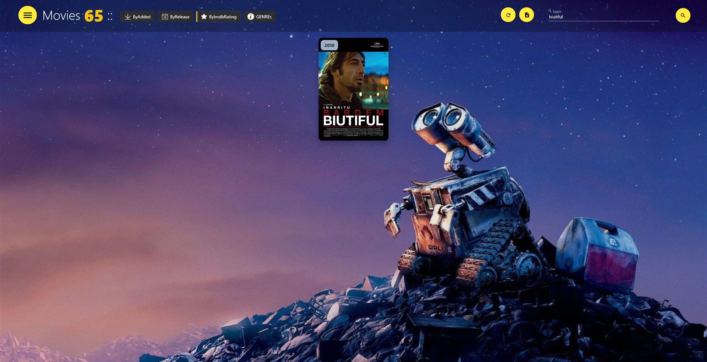

# Plix
Plix is your assistant to manage your local movies , its a WPF app develope on .net 5  . its help you to manage your movies folder , search in your movies , show movie information and ...
plix use sqlite to manage movies information and need internet connection just to get information once and thene you can use it offline

**Packages Used**
|Package|Version|
| ------------------- | :-----------: |
|.Net Core|5|
|AutoMapper|8.0.0|
|Fody|6.5.2|
|HandyControls|3.3.7|
|MaterialDesignColors|2.1.0|
|MaterialDesignThemes|4.1.0|
|Microsoft.EntityFrameworkCore|5.0.8|
|Microsoft.EntityFrameworkCore.Sqlite|5.0.5|
|Newtonsoft.Json|13.0.1|
|RestSharp|106.12.0|
|Prism.Unity|8.1.97|
|Prism.Wpf|8.1.97|
|Xam.Plugins.Settings|4.1.0|

# Screenshots

## HomePage

## MovieDialog

## Settings

## GenreDialog

## Searched
